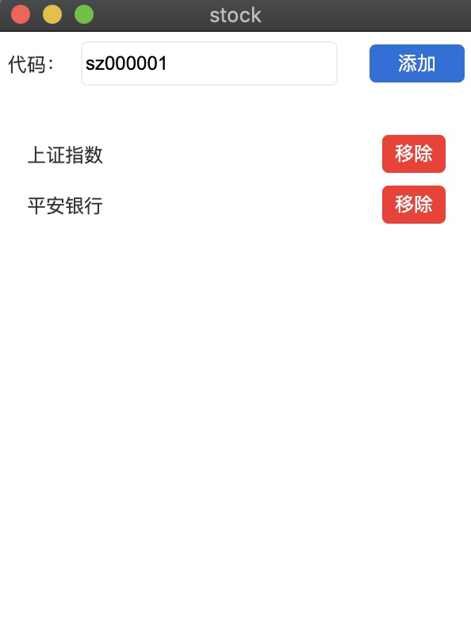

# electron-stock


```bash
# Clone this repository
git clone https://github.com/tale503/stock
# Go into the repository
cd stock
# Install dependencies
npm install
# Run the app
npm start
```

## 描述
隐蔽查看股票涨跌小应用。

## 说明
1.软件安装包在pack文件夹里

2.鼠标放在红框外部可以拖动，四角可以放大缩小展示框，双击文字弹出编辑弹窗。




数据来源：http://qt.gtimg.cn
